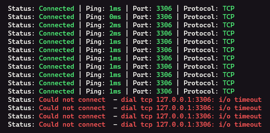

# tcpcheck - A tool to check TCP connections
A tool I created to check TCP connections, which I use frequently across multiple devices. So I created this repository so that you can install it with `go install`.

## Installation
```
go install github.com/Towsif12/tcpcheck@latest
```
If you want to build it yourself, feel free to clone the repository and run `go build`

## Usage
```
tcpcheck 127.0.0.1 3306
```

